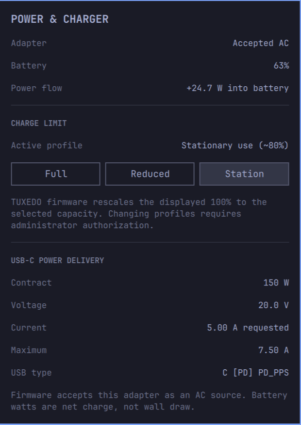

# Omarchy Charger Monitor

An Omarchy bar widget for live battery power flow, USB-C Power Delivery
contracts, and TUXEDO charging-profile management.



## Features

- Live net battery charge or discharge power
- USB-C PD voltage, requested current, maximum current, and contract wattage
- TUXEDO Full, Reduced (~90%), and Stationary (~80%) charging profiles
- Active charging-profile display and verified profile changes

## Requirements

- Omarchy Quattro with shell plugin support
- A battery exposed as `/sys/class/power_supply/BAT0`
- Optional USB-C PD data through Linux UCSI power-supply devices
- Optional TUXEDO charging profiles through `tuxedo_keyboard`
- `bash`, `awk`, and `pkexec`

The live power display works without TUXEDO hardware. Charge-profile buttons
are disabled when the TUXEDO driver does not expose its profile interface.

## Install

```sh
omarchy plugin add https://github.com/edofic/omarchy-charger-monitor.git --enable
```

Choose the right bar section if prompted. Click the wattage in the bar to open
the detail panel. Changing a firmware charging profile opens an administrator
authorization prompt.

TUXEDO firmware rescales the selected physical capacity to 100% in Linux, so
the displayed percentage can still reach 100% under Reduced or Stationary use.

## Remove

```sh
omarchy plugin remove edofic.charger-monitor
```

## Development

```sh
omarchy plugin validate .
bash -n charger-info charger-profile
```

## License

MIT
